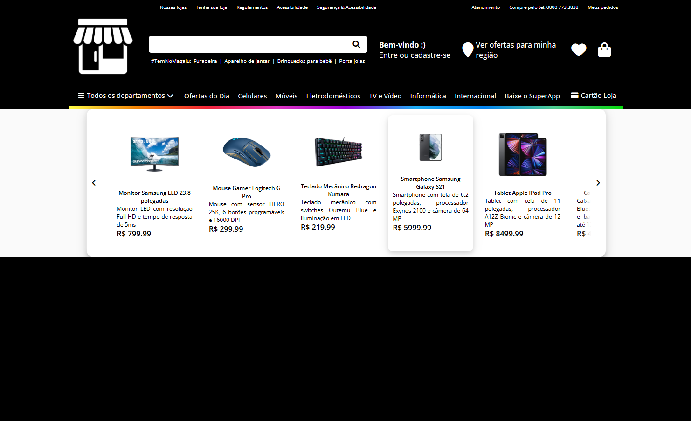

# 💻 E-commerce Magazine Luiza Clone



Este projeto é uma réplica simplificada de um site de e-commerce, com o design e a experiência do usuário inspirados na interface da **Magazine Luiza**. 🛍️ Desenvolvido para aprimorar minhas habilidades em **HTML**, **CSS** e **JavaScript** no desenvolvimento front-end, o projeto simula um catálogo de produtos e a navegação por uma loja virtual.

---

## ✨ Funcionalidades

-   **Catálogo de Produtos**: Exibição de produtos com nome, preço e imagem.

---

## 🛠️ Tecnologias

-   **HTML**: Estrutura e marcação da página.
-   **CSS**: Estilização e design da interface.
-   **JavaScript**: Lógica e interatividade do site.

---

## 🚀 Como Executar Localmente

Siga os passos abaixo para ter uma cópia do projeto em sua máquina e executá-lo localmente:

1.  **Pré-requisitos**: Certifique-se de ter o **Visual Studio Code** instalado. Para facilitar a execução, instale a extensão **"Live Server"** ou **"Five Server"**.
2.  **Faça um fork**: Clique no botão **"Fork"** no canto superior direito deste repositório para criar uma cópia em sua conta.
3.  **Clone o projeto**: Abra o seu terminal e execute o seguinte comando, substituindo `SEU_USUARIO` pelo seu nome de usuário do GitHub:

    ```bash
    git clone [https://github.com/SEU_USUARIO/site-ecommerce.git](https://github.com/SEU_USUARIO/site-ecommerce.git)
    ```

4.  **Abra no VS Code**: Navegue até a pasta do projeto clonado e abra-a no Visual Studio Code.
5.  **Execute o servidor**: Abra o arquivo `index.html` e clique com o botão direito, selecionando a opção **"Open with Live Server"** (ou "Five Server"). Isso iniciará um servidor local e abrirá o projeto no seu navegador padrão.

---

## 🧑‍💻 Autor

[Gabriel Lacerda](https://www.linkedin.com/in/gabriellacerda1005/) - Desenvolvedor Front-end e criador deste projeto. Sinta-se à vontade para conectar-se! 👋